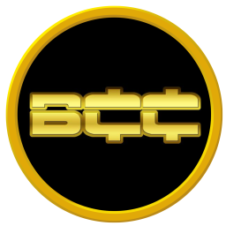

BarrelCrudeCoin Project
===================================== 

 
---------------- 
BarrelCrudeCoin
----------------
https://www.barrelcrudecoin.com/

License
-------

BarrelCrudeCoin is released under the terms of the MIT license. See `COPYING` for more
information or see http://opensource.org/licenses/MIT.

Development process
-------------------

Join our Discord - https://discord.gg/NfSw2CPqEQ

Developers work in their own trees, then submit pull requests when they think
their feature or bug fix is ready.

If it is a simple/trivial/non-controversial change, then one of the BarrelCrudeCoin
development team members simply pulls it.

If it is a *more complicated or potentially controversial* change, then the patch
submitter will be asked to start a discussion with the devs and community.

The patch will be accepted if there is broad consensus that it is a good thing.
Developers should expect to rework and resubmit patches if the code doesn't
match the project's coding conventions (see `doc/coding.txt`) or are
controversial.

The `master` branch is regularly built and tested, but is not guaranteed to be
completely stable. [Tags](https://github.com/barrelcrudecoin/barrelcrudecoin/tags) are created
regularly to indicate new official, stable release versions of BarrelCrudeCoin.
