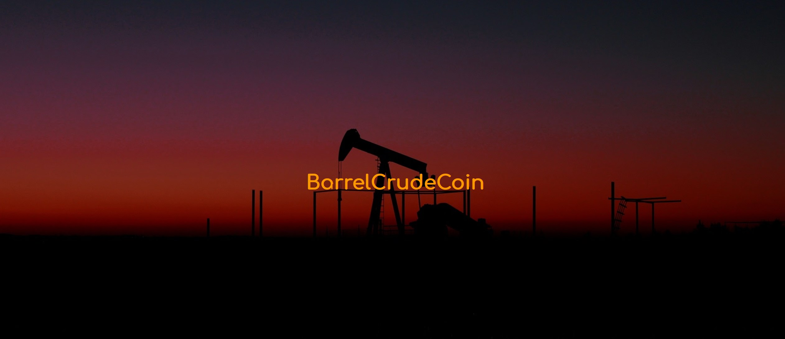

BarrelCrudeCoin Project 
===================================== 

 
---------------- 
BarrelCrudeCoin 
----------------
https://www.barrelcrudecoin.com/

Join our Discord - https://discord.com/invite/MrCDmBj3GZ
Join our Telegram - https://t.me/barrelcrudecoinofficial

BARRELCRUDECOIN Is a currency based on the number of barrels of crude 
that still remain to be extracted from the planet since 2021. 

Currently the world oil reserves are 1,700,804 Billion barrels and 1,700,804 Million coins will be created.

----------------

---------------- 
Specifications 
----------------
+ #### name: BarrelCrudeCoin

+ #### ticker: BCC

+ #### max supply: 1,700,804

+ #### p2p port: 3335

+ #### rpc port: 3334

+ #### block maturity: 150

+ #### block time: 15 seconds

+ #### block reward: 0.1 BCC

+ #### block premined: none

+ #### block difficulty: 1 block (15 seconds)

+ #### halving: 8,504,020 (4 years 16 days approximately)

+ #### 97 years  and 28 days of mining process with rewards (approximately)

----------------

August 27, 1859, at a depth of 23 meters, the precious liquid finally began to flow. With the help of a pump, Drake's men started the extraction: on the first day of work they already filled 25 barrels.

In 2021, barrels of crude oil continue to be extracted and there are still many years of extraction, but the conversion to electric vehicles is a present and future reality.

The objective of BARRELCRUDECOIN, to be the link between classical oil extraction and electric crude extraction. 

This currency will be the new fuel for your electric vehicle,
with an ultra-fast payment system with the mobile App.

You can recharge the batteries of your electric vehicle at gas stations 
and pay comfortably with your mobile phone.

License
-------

BarrelCrudeCoin is released under the terms of the MIT license. See `COPYING` for more
information or see http://opensource.org/licenses/MIT.

